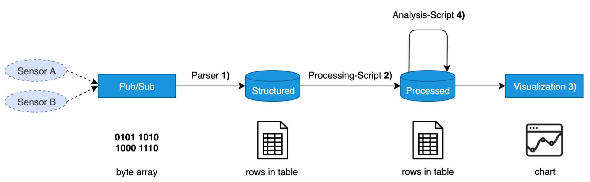
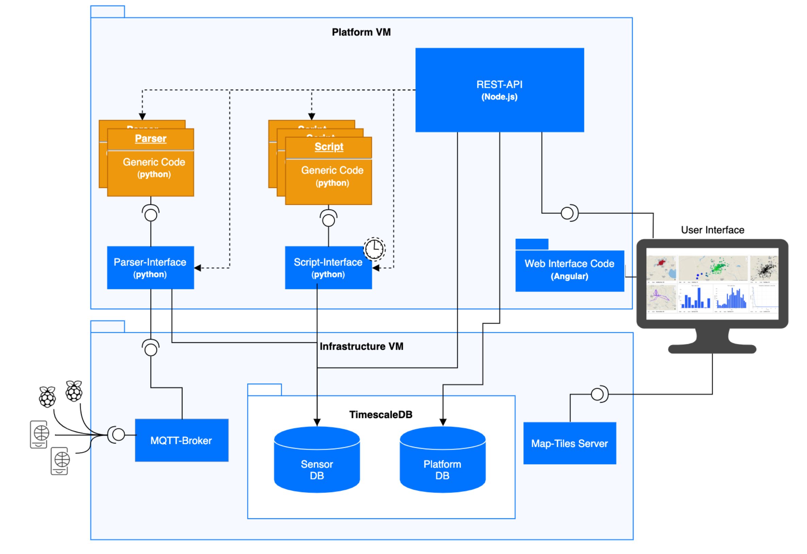
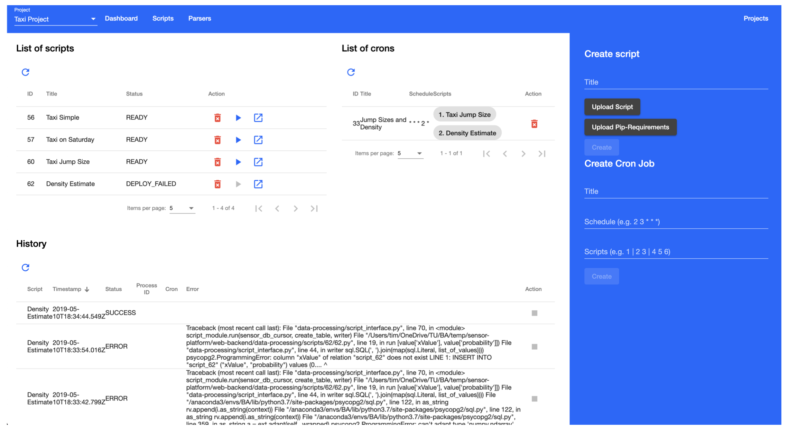
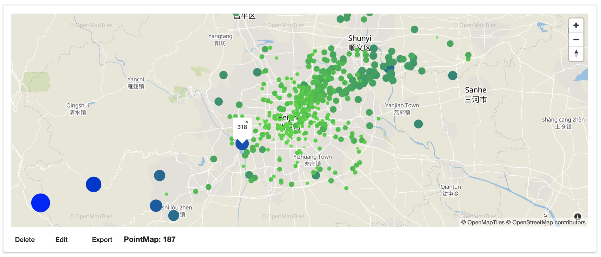

# STAV

With the number of sensing devices growing fast over the last years designing data pipelines to collect, 
store and process their data is of utter importance for many applications.
Because of the wide diversity of data formats and communication standards a flexible pipeline is needed.
In this thesis we provide a simple solution that is flexible enough to deal with the variety of use cases, 
integrates all steps from data collection to data exploration and is modular enough to allow the integration of external solutions. 
It enables the user to correlate different data by time and location for data exploration or data driven decision-making.  

The thesis can be found here: https://www.in.tum.de/fileadmin/w00bws/cm/thesis/bt-pfeifle2019.pdf

## Overview
We will 1) Obtain the sensor data from the Pub/Sub interface and parse it into structured Data, which we then 2) Scrub using custom processing scripts. Those results are then available for 3) Exploring through visualization components. Analysis scripts can run on the processed data for 4) Modeling and allow the user to easily 5) Interpret the sensor data, as shown below:


This pipeline is realized by the following components:


## Frontend
Install dependencies
```bash
cd web-frontend
npm install
npm i --only=dev
```

Build Frontend requires the angular CLI (npm install -g @angular/cli)
```bash
ng build
```

To build for production create a file "/web-frontend/src/environments/environment.prod.ts" and then run
```
ng build --prod
```

Serve the content with node server.js

## Backend
Install Dependencies
```bash
cd web-backend
npm install
npm i --only=dev
npm install -g ts-node
```

To build for production create a file "/web-backend/environments/production.env" and then run
```
export NODE_ENV=production
```
To start the backend run:
```
npm run start
```


## Results
To automate the analysis of the data we provide the following automation UI:


The visualization capabilities allow many different types of charts such as the following:
